# X402 产品逻辑流程图

**版本**: 1.0.0
**最后更新**: 2025-10-30
**文档类型**: 产品逻辑可视化

---

## 📑 目录

- [1. 核心业务流程](#1-核心业务流程)
- [2. 零Gas模式详细流程](#2-零gas模式详细流程)
- [3. 任务状态机](#3-任务状态机)
- [4. 资金流转图](#4-资金流转图)
- [5. 系统交互序列图](#5-系统交互序列图)
- [6. 用户角色交互图](#6-用户角色交互图)

---

## 1. 核心业务流程

### 1.1 完整任务生命周期流程图

```mermaid
graph TB
    Start([用户访问 X402]) --> CheckWallet{钱包已连接?}
    CheckWallet -->|否| ConnectWallet[连接 MetaMask]
    CheckWallet -->|是| ChooseRole{选择角色}
    ConnectWallet --> ChooseRole

    ChooseRole -->|Creator| CreateTask[创建任务]
    ChooseRole -->|Worker| BrowseTasks[浏览任务]
    ChooseRole -->|Verifier| VerifyTasks[验证任务]

    %% Creator 流程
    CreateTask --> ChooseMode{选择创建模式}
    ChooseMode -->|标准模式| StandardMode[2次交易<br/>需要 ETH]
    ChooseMode -->|零Gas模式| ZeroGasMode[1次签名<br/>无需 ETH]

    StandardMode --> ApproveUSDC[1. Approve USDC]
    ApproveUSDC --> CallCreate[2. Create Task]
    CallCreate --> TaskCreated[任务创建成功<br/>状态: Open]

    ZeroGasMode --> SignEIP3009[签名 EIP-3009]
    SignEIP3009 --> SendToFacilitator[发送到 Facilitator]
    SendToFacilitator --> FacilitatorProcess[Facilitator 代付 Gas]
    FacilitatorProcess --> TaskCreated

    %% Worker 流程
    BrowseTasks --> FilterTasks[过滤 Open 任务]
    FilterTasks --> SelectTask[选择任务]
    SelectTask --> CheckStake{需要质押?}
    CheckStake -->|是| PayStake[支付质押<br/>20% 奖励]
    CheckStake -->|否| AssignTask[接取任务]
    PayStake --> AssignTask
    AssignTask --> TaskAssigned[任务状态: Assigned]

    TaskAssigned --> WorkOnTask[执行任务]
    WorkOnTask --> UploadIPFS[上传结果到 IPFS]
    UploadIPFS --> SubmitResult[提交 IPFS 哈希]
    SubmitResult --> TaskSubmitted[任务状态: Submitted]

    %% Verifier 流程
    VerifyTasks --> ReviewList[查看待验证列表]
    ReviewList --> DownloadResult[下载 IPFS 结果]
    DownloadResult --> Review[审核质量]
    Review --> Decision{审核结果}

    Decision -->|通过| ApproveTask[verifyTask(true)]
    Decision -->|拒绝| RejectTask[verifyTask(false)]

    ApproveTask --> TaskVerified[任务状态: Verified]
    TaskVerified --> AutoSettle[自动结算]
    AutoSettle --> DistributeFunds[分配资金<br/>Worker 98%<br/>Platform 1.5%<br/>Verifier 0.5%]
    DistributeFunds --> RefundStake[退还质押]
    RefundStake --> TaskCompleted[任务状态: Completed]

    RejectTask --> TaskRejected[任务状态: Rejected]
    TaskRejected --> RetrySubmit{Worker 重新提交?}
    RetrySubmit -->|是| WorkOnTask
    RetrySubmit -->|否| TaskAssigned

    TaskCompleted --> End([流程结束])

    style Start fill:#e1f5ff
    style End fill:#e1f5ff
    style TaskCreated fill:#d4edda
    style TaskAssigned fill:#fff3cd
    style TaskSubmitted fill:#cce5ff
    style TaskVerified fill:#d1ecf1
    style TaskCompleted fill:#d4edda
    style TaskRejected fill:#f8d7da
    style ZeroGasMode fill:#e7d4f7
    style FacilitatorProcess fill:#e7d4f7
```

### 1.2 任务创建模式对比流程

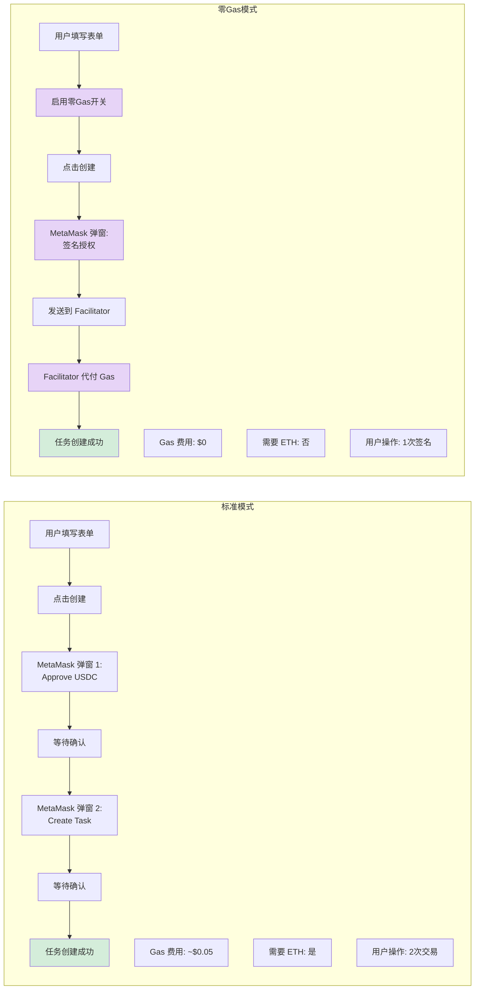

---

## 2. 零Gas模式详细流程

### 2.1 EIP-3009 零Gas创建任务流程

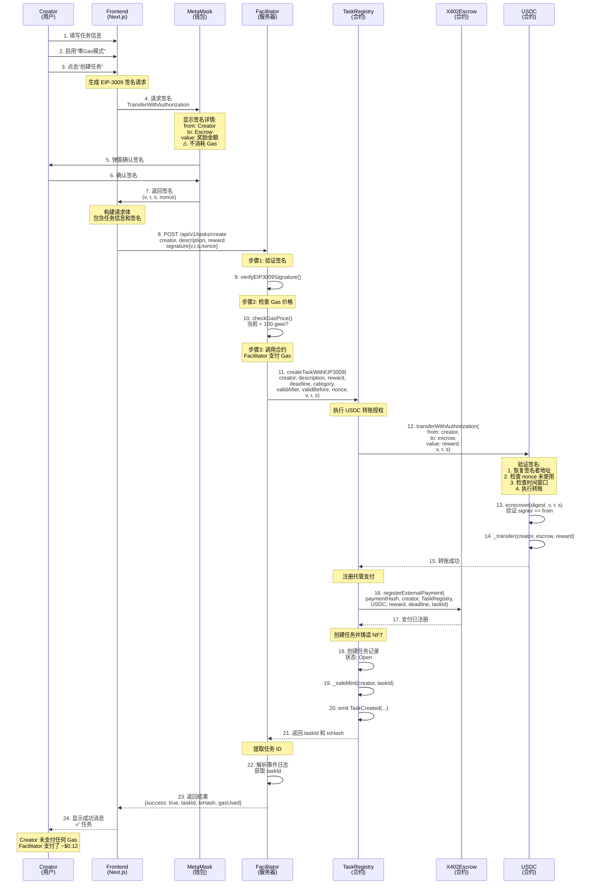

### 2.2 EIP-3009 签名生成流程

```mermaid
graph TB
    Start([开始生成签名]) --> GetSigner[获取 Wallet Signer]
    GetSigner --> GenerateNonce[生成随机 Nonce<br/>32 bytes]
    GenerateNonce --> SetTimeWindow[设置时间窗口<br/>validAfter: 0<br/>validBefore: now + 1h]

    SetTimeWindow --> BuildDomain[构建 EIP-712 Domain]
    BuildDomain --> DomainDetails[name: 'USD Coin'<br/>version: '1'<br/>chainId: 31337<br/>verifyingContract: USDC]

    DomainDetails --> BuildTypes[定义 Types]
    BuildTypes --> TypesDetails[TransferWithAuthorization:<br/>- from: address<br/>- to: address<br/>- value: uint256<br/>- validAfter: uint256<br/>- validBefore: uint256<br/>- nonce: bytes32]

    TypesDetails --> BuildMessage[构建 Message]
    BuildMessage --> MessageDetails[from: Creator 地址<br/>to: Escrow 地址<br/>value: 奖励金额<br/>validAfter: 0<br/>validBefore: timestamp<br/>nonce: 随机值]

    MessageDetails --> SignTypedData[调用 signer.signTypedData<br/>domain, types, message]
    SignTypedData --> MetaMaskPrompt[MetaMask 弹窗<br/>显示签名详情]

    MetaMaskPrompt --> UserConfirm{用户确认?}
    UserConfirm -->|取消| Cancelled([签名取消])
    UserConfirm -->|确认| GetSignature[获取签名字符串<br/>0x1234...]

    GetSignature --> SplitSignature[分解签名<br/>ethers.Signature.from]
    SplitSignature --> ExtractVRS[提取 v, r, s]

    ExtractVRS --> ReturnSignature[返回签名对象]
    ReturnSignature --> SignatureObject["{<br/>  v: 27 or 28,<br/>  r: '0x123...',<br/>  s: '0x456...',<br/>  nonce: '0x789...',<br/>  validAfter: 0,<br/>  validBefore: 1730000000<br/>}"]

    SignatureObject --> End([签名生成完成])

    style Start fill:#e1f5ff
    style End fill:#d4edda
    style Cancelled fill:#f8d7da
    style MetaMaskPrompt fill:#fff3cd
    style SignatureObject fill:#d4edda
```

---

## 3. 任务状态机

### 3.1 完整状态转换图

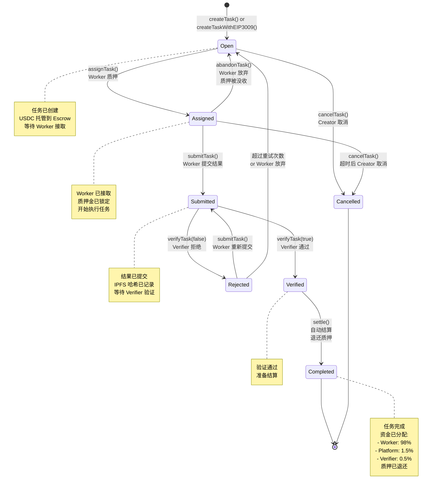

### 3.2 状态转换权限矩阵

```mermaid
graph TB
    subgraph 状态转换权限
        Open[Open 状态]
        Assigned[Assigned 状态]
        Submitted[Submitted 状态]
        Verified[Verified 状态]
        Completed[Completed 状态]
        Cancelled[Cancelled 状态]
        Rejected[Rejected 状态]

        Open -->|assignTask<br/>任何人| Assigned
        Open -->|cancelTask<br/>Creator| Cancelled

        Assigned -->|submitTask<br/>Worker| Submitted
        Assigned -->|abandonTask<br/>Worker| Open
        Assigned -->|cancelTask<br/>Creator 超时后| Cancelled

        Submitted -->|verifyTask(true)<br/>Verifier| Verified
        Submitted -->|verifyTask(false)<br/>Verifier| Rejected

        Rejected -->|submitTask<br/>Worker| Submitted

        Verified -->|settle<br/>System 自动| Completed
    end

    style Open fill:#e1f5ff
    style Assigned fill:#fff3cd
    style Submitted fill:#cce5ff
    style Verified fill:#d1ecf1
    style Completed fill:#d4edda
    style Cancelled fill:#f8d7da
    style Rejected fill:#f8d7da
```

---

## 4. 资金流转图

### 4.1 USDC 资金流转全景图

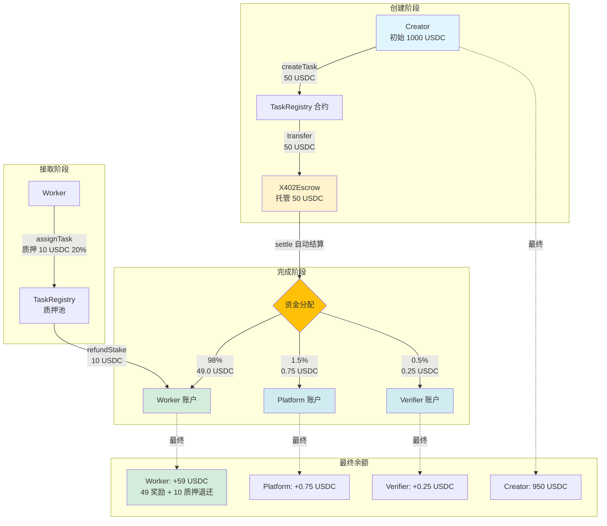

### 4.2 质押机制流程

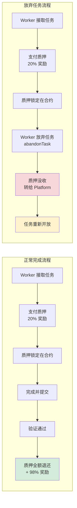

---

## 5. 系统交互序列图

### 5.1 标准模式创建任务序列图

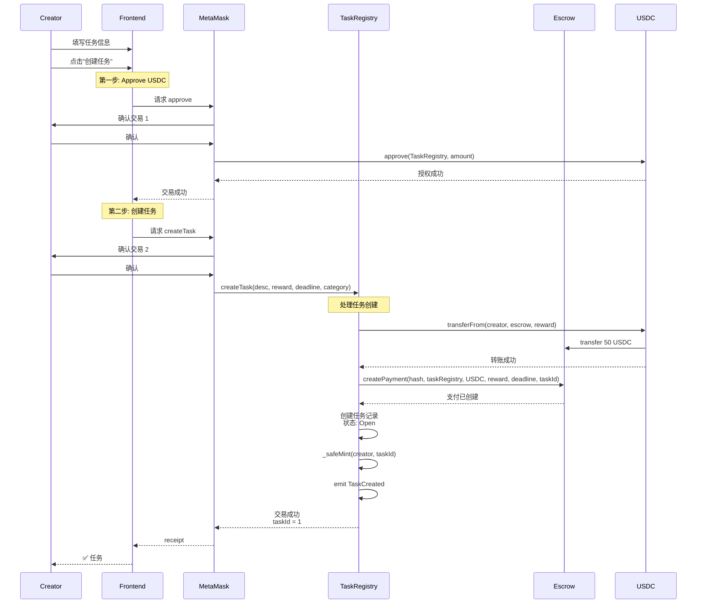

### 5.2 Worker 接取并完成任务序列图

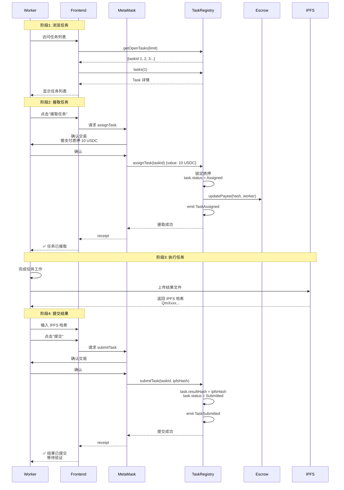

### 5.3 Verifier 验证并结算序列图

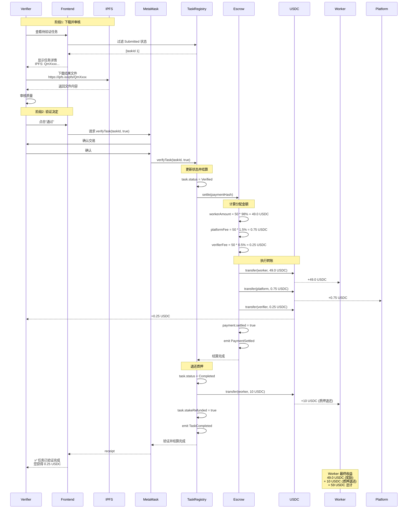

---

## 6. 用户角色交互图

### 6.1 多角色协作流程

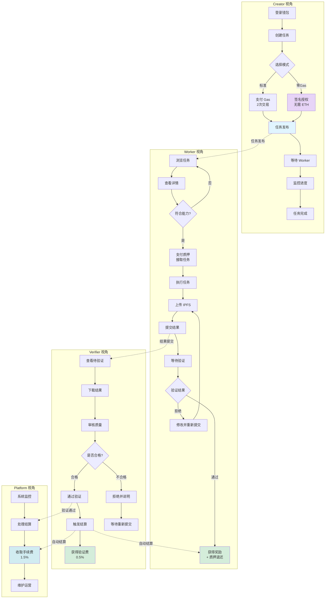

### 6.2 异常处理流程

```mermaid
graph TB
    Start([任务执行中]) --> Check{检测异常}

    Check -->|Worker 超时| Timeout[deadline 已过<br/>status: Assigned]
    Timeout --> CreatorCancel[Creator 调用 cancelTask]
    CreatorCancel --> RefundCreator[退款给 Creator]
    RefundCreator --> RefundWorkerStake[退还 Worker 质押]
    RefundWorkerStake --> End1([任务取消])

    Check -->|Worker 放弃| Abandon[Worker 调用 abandonTask]
    Abandon --> SlashStake[没收质押<br/>转给 Platform]
    SlashStake --> ReopenTask[任务重新开放<br/>status: Open]
    ReopenTask --> End2([等待新 Worker])

    Check -->|验证拒绝| Reject[Verifier 拒绝<br/>verifyTask(false)]
    Reject --> UpdateStatus[status: Rejected]
    UpdateStatus --> WorkerRetry{Worker 重试?}
    WorkerRetry -->|是| Resubmit[修改并重新提交<br/>submitTask]
    WorkerRetry -->|否| WorkerAbandon[Worker 放弃]
    Resubmit --> End3([重新等待验证])
    WorkerAbandon --> SlashStake

    Check -->|Facilitator 宕机| FacilitatorDown[零Gas服务不可用]
    FacilitatorDown --> SwitchMode{用户选择}
    SwitchMode -->|切换| StandardMode[使用标准模式]
    SwitchMode -->|等待| WaitRetry[等待服务恢复]
    SwitchMode -->|备用| BackupFacilitator[使用备用 Facilitator]
    StandardMode --> End4([继续创建])
    WaitRetry --> End5([稍后重试])
    BackupFacilitator --> End6([继续创建])

    Check -->|Gas 过高| HighGas[Gas > 100 gwei]
    HighGas --> FacilitatorReject[Facilitator 拒绝]
    FacilitatorReject --> NotifyUser[通知用户<br/>Gas 价格过高]
    NotifyUser --> UserChoice{用户选择}
    UserChoice -->|等待| WaitGas[等待 Gas 降低]
    UserChoice -->|标准| UseStandard[使用标准模式<br/>自行支付 Gas]
    WaitGas --> End7([稍后重试])
    UseStandard --> End8([继续创建])

    style End1 fill:#f8d7da
    style End2 fill:#fff3cd
    style End3 fill:#cce5ff
    style End4 fill:#d4edda
    style End5 fill:#fff3cd
    style End6 fill:#d4edda
    style End7 fill:#fff3cd
    style End8 fill:#d4edda
    style SlashStake fill:#f8d7da
```

---

## 7. 技术流程图

### 7.1 Facilitator 服务处理流程

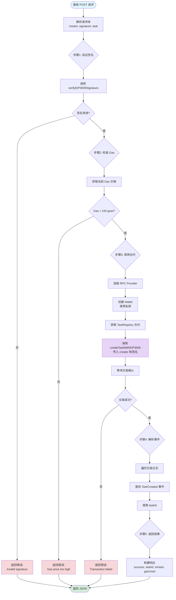

### 7.2 签名验证流程（USDC 合约）

```mermaid
graph TB
    Start([transferWithAuthorization]) --> GetParams[获取参数<br/>from, to, value<br/>validAfter, validBefore<br/>nonce, v, r, s]

    GetParams --> Check1{检查1: Nonce}
    Check1 --> CheckNonce[authorizationState<br/>from, nonce]
    CheckNonce --> NonceUsed{Nonce 已使用?}
    NonceUsed -->|是| Error1[Revert:<br/>Nonce already used]
    NonceUsed -->|否| Check2{检查2: 时间窗口}

    Check2 --> CheckTime1[block.timestamp > validAfter?]
    CheckTime1 --> TimeValid1{有效?}
    TimeValid1 -->|否| Error2[Revert:<br/>Not yet valid]
    TimeValid1 -->|是| CheckTime2[block.timestamp < validBefore?]
    CheckTime2 --> TimeValid2{有效?}
    TimeValid2 -->|否| Error3[Revert:<br/>Authorization expired]

    TimeValid2 -->|是| Check3{检查3: 签名验证}
    Check3 --> BuildDigest[构建 EIP-712 Digest]
    BuildDigest --> DigestSteps["digest = keccak256(<br/>  '\\x19\\x01',<br/>  DOMAIN_SEPARATOR,<br/>  structHash<br/>)"]

    DigestSteps --> Recover[ecrecover(digest, v, r, s)]
    Recover --> GetSigner[获取签名者地址]
    GetSigner --> CompareSigner{signer == from?}
    CompareSigner -->|否| Error4[Revert:<br/>Invalid signature]

    CompareSigner -->|是| Step4[步骤4: 标记 Nonce]
    Step4 --> MarkNonce[authorizationState<br/>from, nonce = true]

    MarkNonce --> Step5[步骤5: 执行转账]
    Step5 --> Transfer[_transfer(from, to, value)]
    Transfer --> End([转账成功])

    Error1 --> Fail([交易失败])
    Error2 --> Fail
    Error3 --> Fail
    Error4 --> Fail

    style Start fill:#e1f5ff
    style End fill:#d4edda
    style Fail fill:#f8d7da
    style Recover fill:#fff3cd
    style Transfer fill:#d4edda
```

---

## 8. 前端状态管理流程

### 8.1 任务创建表单状态流

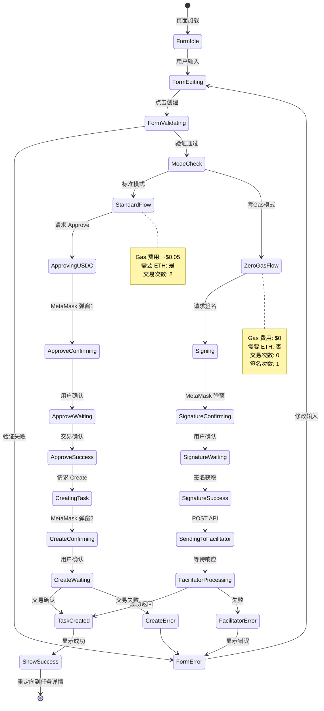

### 8.2 任务列表数据获取流程

```mermaid
graph TB
    Start([组件加载]) --> InitHook[初始化 React Hooks]
    InitHook --> GetTaskCount[useReadContract:<br/>getTotalTasks]
    GetTaskCount --> ReceiveCount[taskCount = 10]

    ReceiveCount --> BuildArray[构建 taskId 数组<br/>[1, 2, 3, ..., 10]]
    BuildArray --> BatchRead[useReadContracts:<br/>批量读取任务]

    BatchRead --> ReadLoop{遍历 taskIds}
    ReadLoop --> ReadTask[读取 tasks(id)]
    ReadTask --> NextTask{还有更多?}
    NextTask -->|是| ReadLoop
    NextTask -->|否| ProcessData[处理返回数据]

    ProcessData --> FilterStatus[过滤状态<br/>status === Open]
    FilterStatus --> SortTasks[排序<br/>按创建时间降序]
    SortTasks --> MapDisplay[映射到 UI 组件]

    MapDisplay --> RenderCard[渲染任务卡片]
    RenderCard --> DisplayInfo[显示信息:<br/>- 描述<br/>- 奖励<br/>- 截止时间<br/>- 分类]

    DisplayInfo --> End([渲染完成])

    style Start fill:#e1f5ff
    style End fill:#d4edda
    style BatchRead fill:#fff3cd
    style FilterStatus fill:#cce5ff
```

---

## 9. 总结

### 9.1 核心流程对比表

| 流程阶段 | 标准模式 | 零Gas模式 | 优势 |
|---------|---------|----------|------|
| **用户操作** | 2次交易确认 | 1次签名 | 零Gas: 更简单 |
| **Gas成本** | ~$0.05 | $0 | 零Gas: 无成本 |
| **ETH需求** | 必须有 | 不需要 | 零Gas: 无门槛 |
| **完成时间** | ~6秒 | ~5秒 | 相当 |
| **安全性** | 高（链上验证） | 高（EIP-712签名） | 相当 |
| **复杂度** | 低 | 中 | 标准: 更简单 |
| **用户体验** | 中 | 优秀 | 零Gas: 最佳 |

### 9.2 关键技术创新点

1. **EIP-3009 集成**: USDC 原生支持的授权转账，实现真正的零 Gas
2. **Facilitator 模式**: 服务器代付 Gas，用户无需持有 ETH
3. **双模式支持**: 标准模式和零 Gas 模式无缝切换
4. **质押机制**: 防止 Worker 恶意接单后放弃
5. **自动结算**: Verifier 验证后自动分配资金
6. **NFT 任务**: 每个任务是一个 NFT，可转让和交易

### 9.3 流程优化建议

1. **批量操作**: 支持一次签名创建多个任务
2. **自动重试**: Facilitator 失败时前端自动重试
3. **Gas 预测**: 实时显示预估 Gas 费用
4. **状态推送**: WebSocket 实时同步任务状态
5. **通知系统**: 任务状态变更时推送通知给相关方
6. **IPFS 加速**: 使用 Pinata/Web3.Storage 加速文件访问

---

**文档版本**: 1.0.0
**发布日期**: 2025-10-30
**作者**: X402 开发团队
